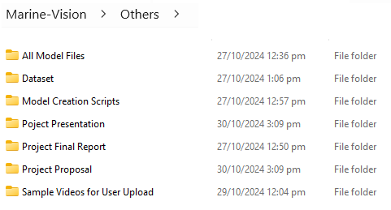

# MarineVision

MarineVision - Enhancing Underwater Videos with Deep Learning

## Background

MarineVision is an advanced platform designed to enhance underwater Videos using deep learning techniques. The application processes underwater videos to that would help identify marine growth, leveraging multiple state-of-the-art models trained for this specific purpose.

The platform allows users to upload underwater videos, process them through different deep learning models, and convert them back into high-quality videos that have enhanced visual clarity and improved contrast.

## Key Features

- Upload underwater videos for enhancement.
- Use multiple deep learning models to enhance image quality.
- Select the best output using quality metrics.
- Convert enhanced images back into video format for easy review.
- Docker-based setup for easy deployment and management.

## Technology Stack

- Python 3.8, 3.9, and 3.11
- Docker & Docker Compose
- FastAPI for backend services
- Flask for the web application
- TensorFlow for deep learning models

## Prerequisites

Before running the application, ensure that you have the following installed:

- **Docker**: [Get Docker](https://docs.docker.com/get-docker/)
- **Docker Compose**: Comes pre-installed with Docker Desktop

## Python Versions of Different Apps

SeapixGanApi Python 3.8  
FUnIEGanApi Python 3.8  
DeepSESRApi Python 3.9  
LDSNetApi Python 3.11  
MarineVisionWebApp Python 3.11

## **Repository Structure**

```plaintext
Marine-Vision/
├── DeepSESRApi/
├── FUNieGanApi/
├── LDSNetApi/
├── SeapixGanApi/
├── MarineVisionWebApp/
├── Others/
│   ├── All Model Files/
│   ├── Dataset/
│   ├── Model_Creation_Scripts/
│   ├── Project Presentation/
│   └── Project Final Report/
│   └── Project Proposal/
│   └── Sample Videos for User Upload/
├── .gitignore
├── README.md
└── docker-compose.yml

```

## **Project Documentation, Model Creation Scripts, Presentation and Other non Application Code related files**

Others/



# Building all applications using docker compose and running in docker contaner (For users)

In the terminal or command prompt, navigate to the Marine-Vison root folder where the docker-compose.yml file is located.  
Enter the follwing commands (You should have Docker installed in your machine). This will install all dependencies and required python versions for each app and start the allication.
The application will be assible at : http://localhost:5001/ upon secessful build and startup

docker-compose build  
docker-compose up

# Stopping all applications using docker compose

docker-compose down

# Listing all running docker containers

docker ps

# Additional Information : Run each applications in terminal (For development work)

Navigate to each projects root folder and end the following in the terminal. (This is only for developers)

SeapixGanApi :  
uvicorn main:app --reload --host 0.0.0.0 --port 8000

FUnIEGanApi :  
uvicorn main:app --reload --host 0.0.0.0 --port 8001

DeepSESRApi :  
uvicorn main:app --reload --host 0.0.0.0 --port 8002

LDSNetApi :  
uvicorn main:app --reload --host 0.0.0.0 --port 8003

MarineVisionWebApp :  
flask run

# Contact

If you encounter any technical issues please reach out to:

Jithin Krishnan  
e-mail: e0941674@u.nus.edu
Handphone: +65 93848580
